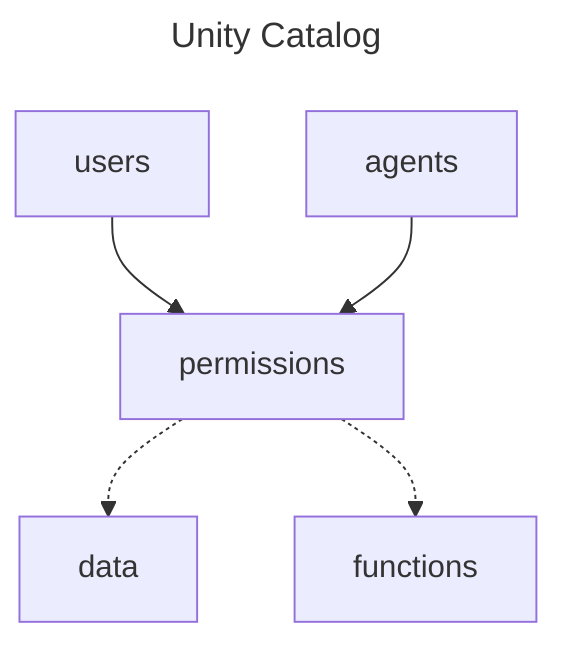
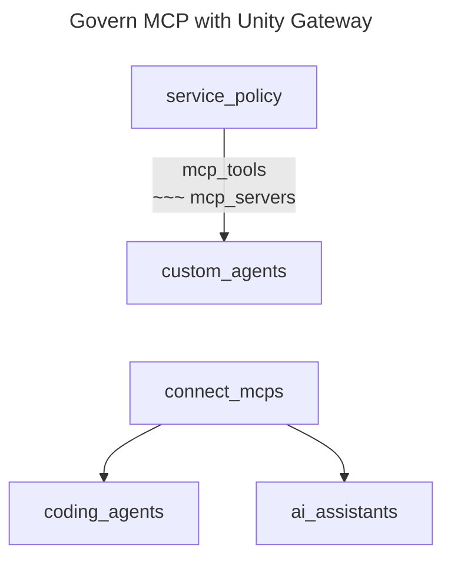
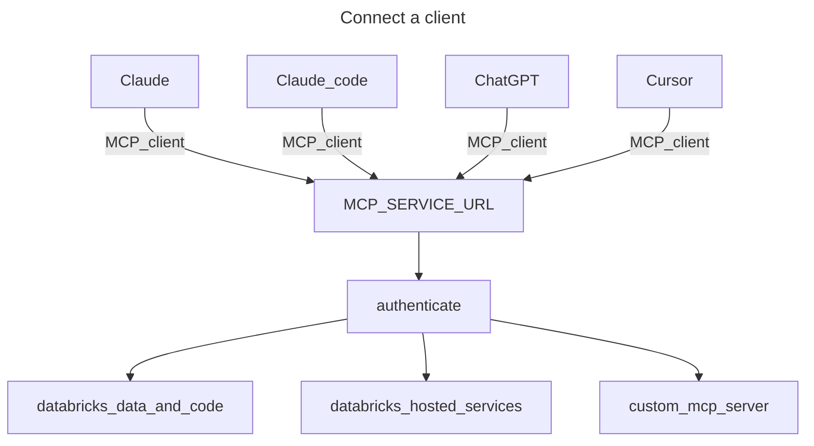
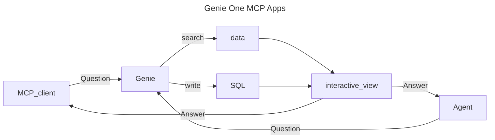
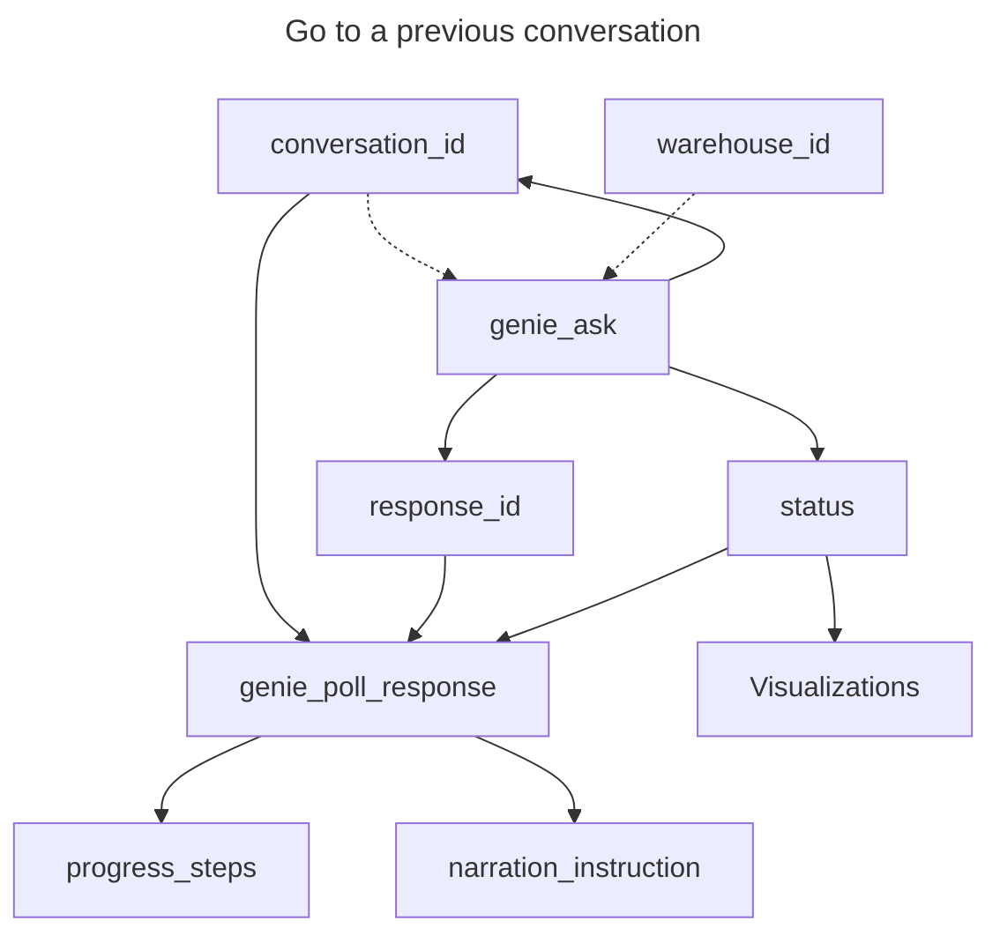
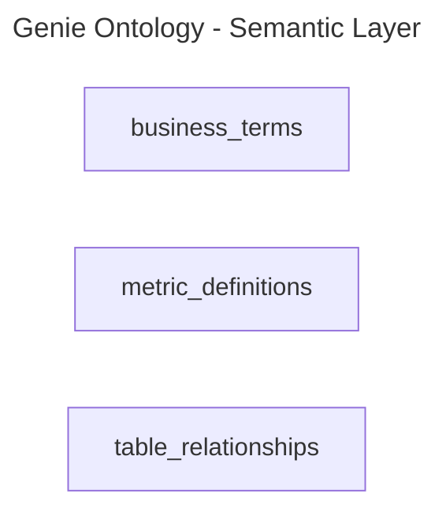
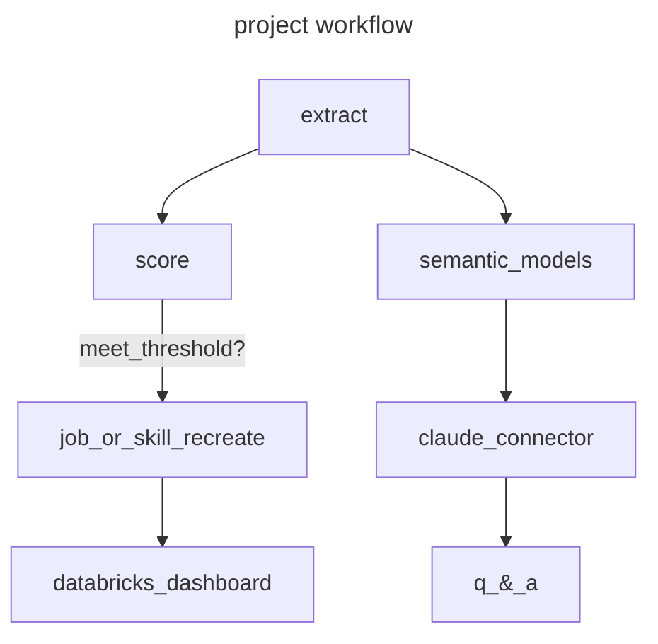

# Connecting Agents to Code with MCP Tools

A workflow that brings data to Coding Agents and Desktop Apps.















**Other native Genie tools**

- genie_get_query_result
- genie_cancel_response
- view_ask --> interactive_view





```

## Unity Catalog Functions

You can store code functions in the Unity Catalog and have MCP clients access these resources. This is particularly useful for structure data retrieval from objects, such as Tableau workbooks.

```python
"""
To run this code:

1. Install libraries: https://docs.databricks.com/aws/en/libraries/workspace-files-libraries

2. Enable serverless compute: https://docs.databricks.com/gcp/en/compute/serverless/#requirements

"""

URL_Pattern = https://<workspace-hostname>/api/2.0/mcp/functions/{catalog}/{schema}/{function_name}

OAuth_scope =https://<workspace-hostname>/api/2.0/mcp/functions/{catalog}/{schema}/{function_name}
```


## MCP Servers

Ideal for undefined logic executed directly in agent code.



